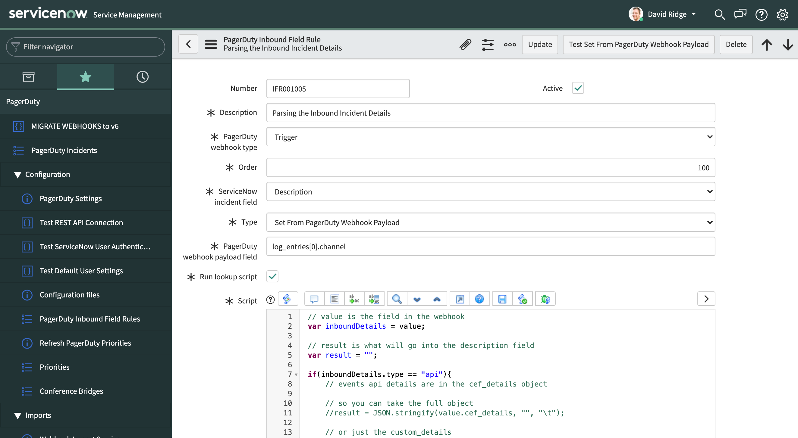

# pd-snow-ifr
ServiceNow Inbound Field Rule for PagerDuty Incidents to map description

The description of a PagerDuty Incident is stored in different places depending on how the incident was created. 
The script in this repo evaluates the type and maps the relevant field to the Description field in the ServiceNow Incident.

1. Create an Inbound Field Rule to parse the description from the PagerDuty Payload
2. Use log_entires[0].channel as the PagerDuty Webhook payload field
3. Copy the script in this repo as the Lookup Script.

